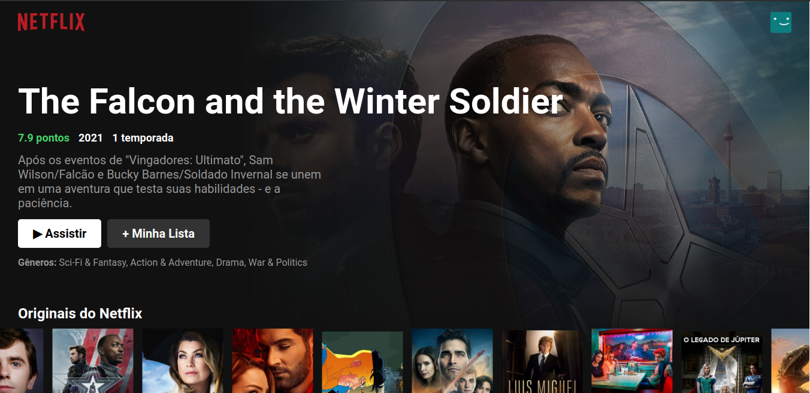
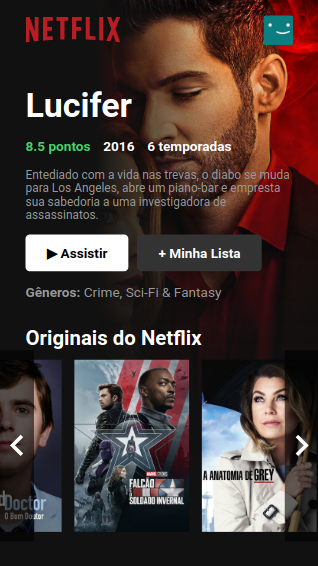

## Clone da UI do Netflix usando React 😺
Projeto feito com o objetivo de aprender a consutar API'S e coletar os dados em json para uso no front-end, feito exclusivamente para aprendizado.
Fiz este projeto com a ajuda de uma live feito pelo Bonieky Lacerda, você pode acessar a live por esse link: https://www.youtube.com/watch?v=tBweoUiMsDg
Talvez o a gravação desta live seja excluido pois mencionam isso nela.

Imagens do projeto:

O projeto faz o uso de uma API que necessita de uma chave, você pode utilizar a minha ou pode criar uma no site: https://www.themoviedb.org/
